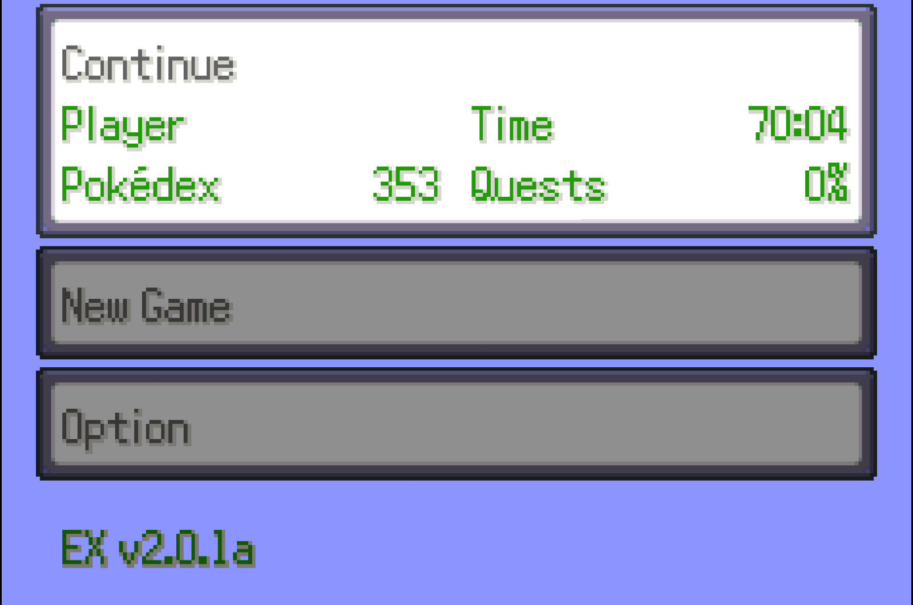
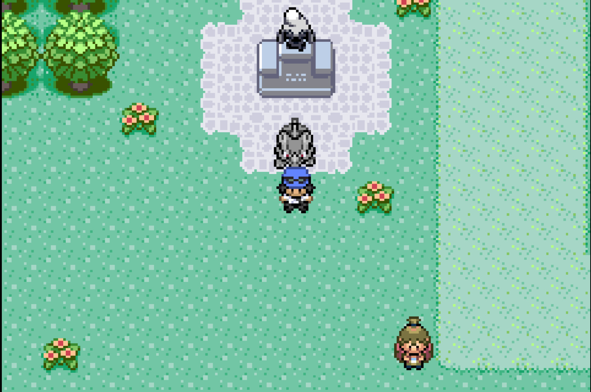
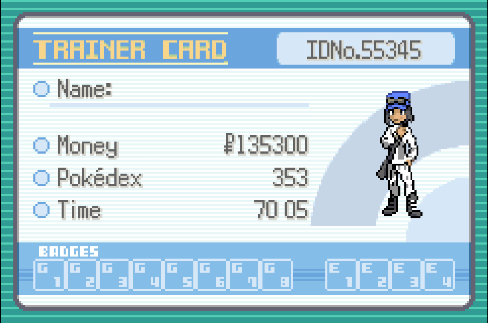
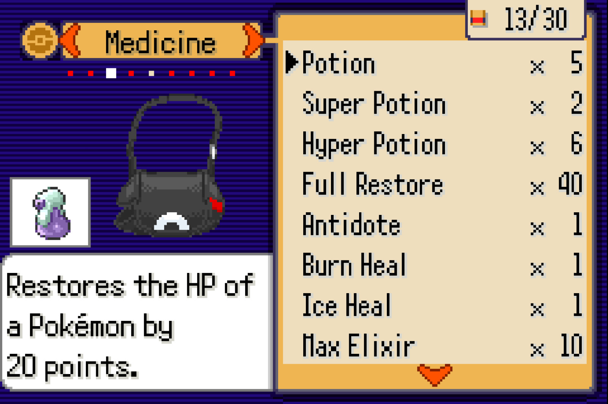

# Pokeemerald-rogue save converter utility

We are all really thankful @Pokabbie for the original project of [pokeemerald-rogue](https://github.com/Pokabbie/pokeemerald-rogue). It has been an incredible revolution for the Pokemon experience but I found an unpleasant issue the last days...

My old .sav files of the 1.3.2 version were no longer compatible with the new version (2.0.1a). I started working on a python program that could surpass such problem and here is the code.

Just ensure to install python and clone this repository:

```
git clone https://github.com/jfzazo/pokeemerald-rogue_savconverter
cd pokeemerald-rogue_savconverter
```

After that, run the program according to your preferences. For instance, you can

1. Print the elements of a .sav file of a game in the 2.0 version
```
python pokeemerald-rogue_savconverter.py Emerald\ Rogue_2_0.sav
```
2. Print the elements of a .sav file of a game in the 1.3.2 version
```
python pokeemerald-rogue_savconverter.py Emerald\ Rogue_1_3_2.sav
```
3. Or the most interesting option: Merge the pokemon, pokedex, money and items of a 1.3.2 .sav with a 2.0 one in the output file
```
python pokeemerald-rogue_savconverter.py Emerald\ Rogue_2_0.sav -m Emerald\ Rogue_1_3_2a.sav -o Emerald\ Rogue_2_0_merged.sav
```
For this option just ensure to rename the output file (Emerald Rogue_2_0_merged.sav) to the same name of the GBA rom so your emulator detects the new .sav.


## Disclaimer

This project worked for me but it is not completely perfect. If you find any kind of issue, please report it, but it is not granted to work under all circumstances or to be totally polished.

## Some pictures





