# Pokeemerald-rogue save converter utility

We are all really thankful @Pokabbie for the original project of [pokeemerald-rogue](https://github.com/Pokabbie/pokeemerald-rogue). It has been an incredible revolution for the Pokemon experience but I found an unpleasant issue the last days...

My old .sav files of the 1.3.2 version were no longer compatible with the new version (2.0.1a). I started working on a python program that could surpass such problem and here is the code.

Just ensure to install python and clone this repository:

```
git clone https://github.com/jfzazo/pokeemerald-rogue_savconverter
cd pokeemerald-rogue_savconverter
```

After that, run the program according to your preferences (modify the input arguments according to the name of your files and paths). For instance, you can

1. Print the elements of a .sav file of a game in the 2.0 version
```
python pokeemerald-rogue_savconverter.py Emerald\ Rogue_2_0.sav
```
2. Print the elements of a .sav file of a game in the 1.3.2 version
```
python pokeemerald-rogue_savconverter.py Emerald\ Rogue_1_3_2.sav
```
3. Or the most interesting option: Merge the pokemon, pokedex, money and items of a 1.3.2 .sav with a 2.0 one in the output file
```
python pokeemerald-rogue_savconverter.py Emerald\ Rogue_2_0.sav -m Emerald\ Rogue_1_3_2a.sav -o Emerald\ Rogue_2_0_merged.sav
```
For this option just ensure to rename the output file (Emerald Rogue_2_0_merged.sav) to the same name of the GBA rom so your emulator detects the new .sav.

## How to run the application: a step-by-step guide

### Installing python

1. Download Python for your Windows system. Get it from the [official sources](https://python.org/downloads) 

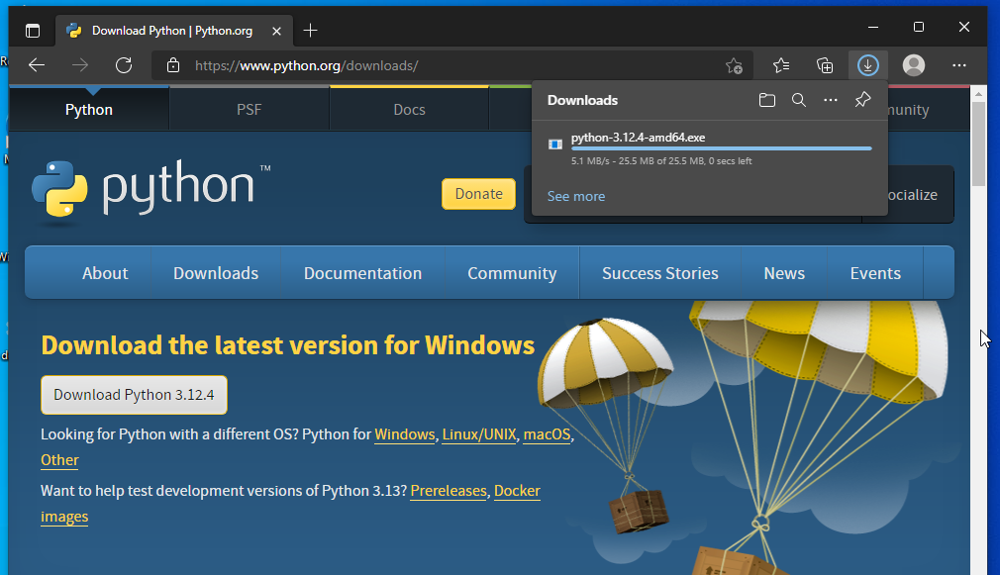

2. Get the installer, run it, and ensure that you are checking the option "Add python.exe to PATH".

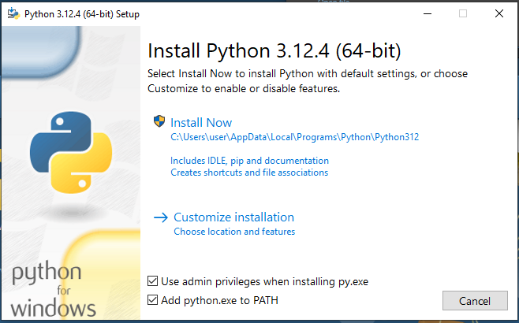

3. Just install the program and wait for its completion.

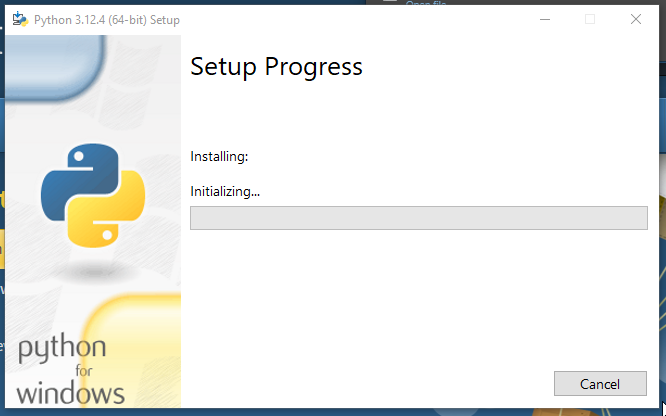

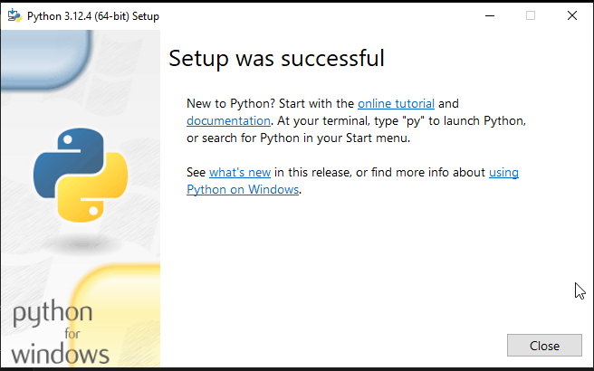

4. Meanwhile you can download the sources of this repo.

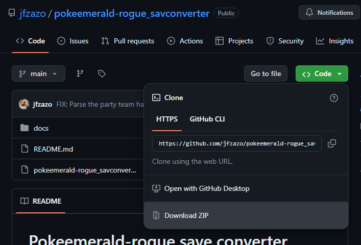

5. Extract the content of the zip file. 

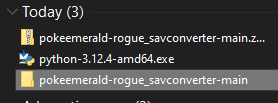

6. Open its content with "File Explorer" and go to the folder that contains the file "pokeemerald-rogue_savconverter.py".

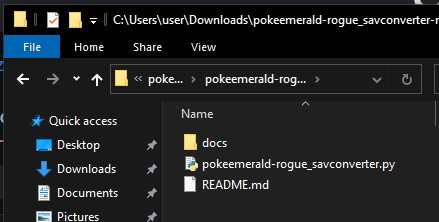

7. Copy the required .sav files. Remember, for the migration process you will need the following two files:
    - A .sav file of the previous game (version 1.3.2). Take into account that you HAVE TO finish your current adventure and save the game while being on the hub. Let's call this save "Emerald Rogue EX (v1.3.2a).sav"
    - A new .sav file of the game in the newest version (2.0/2.0.1). Same considerations here. Please save while being on the hub. We can name this file as "Emerald Rogue_2_0.sav"

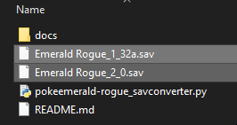

8. Press the "Shift" key + Right click of your mouse. Choose the option "Open Powershell window here". Note that this option will not be displayed if any file is selected. So be sure to unselect any file.

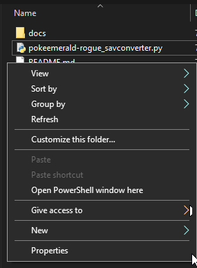

9. Run the program with:

```
python pokeemerald-rogue_savconverter.py 'Emerald Rogue_2_0.sav' -m 'Emerald Rogue_1_3_2a.sav' -o 'Emerald Rogue_2_0_merged.sav'
```

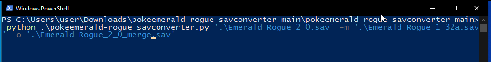

11. Congrats! You should see some output (basically debugging information and stats of the sav file) and a new .sav with the name 'Emerald Rogue_2_0_merged.sav'. Rename/import it to your favourite emulator and enjoy the game!

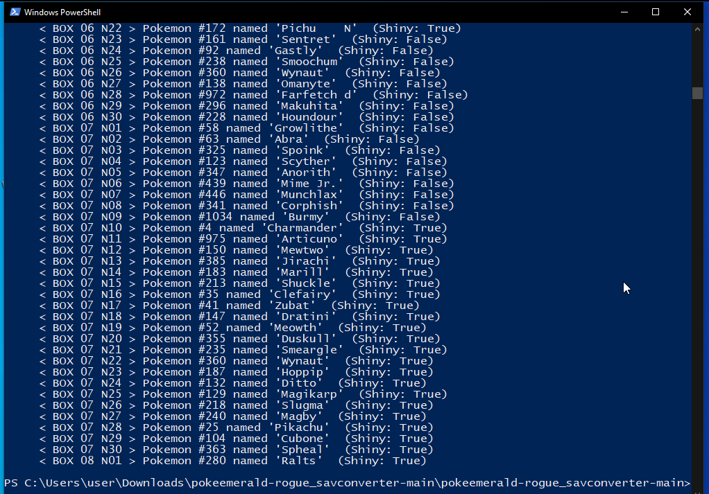

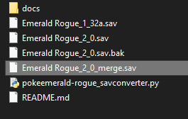


## Disclaimer

This project worked for me but it is not completely perfect. If you find any kind of issue, please report it, but it is not granted to work under all circumstances or to be totally polished.

## Some pictures


